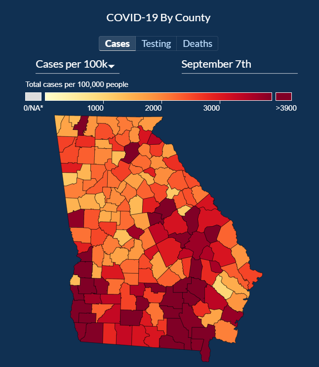

# COVID-19 in Georgia

_Pulled from the [Georgia DPH website](https://dph.georgia.gov/covid-19-daily-status-report)_.

Analysis by Maria Dong, PharmD

## Overview
_covid bg info, stats, hx, etc._

## Rationale
According to the [CDC website](https://www.cdc.gov/coronavirus/2019-ncov/hcp/clinical-guidance-management-patients.html), the average incubation time (meaning the time from exposure to show symptoms) for a COVID patient is 4-5 days. However, this is based only on limited data, given the recent nature of the COVID-19 pandemic. A recent study in [Science Advances](https://advances.sciencemag.org/content/6/33/eabc1202) (_Qin et al_) features the largest sample size so far in studies of its kind, and estimates that the median incubation time is actually closer to **7.76 days**. Therefore, the date lines on the graph of daily new COVID cases are shifted 8 days later, so you can better visualize the effect of the policy/event on COVID cases.

## Analysis
Please access the interactive graphs [here](https://mariajdong.github.io/georgia-covid/).
_images, descriptions, etc._

## Resources
Data for this analysis was pulled from [Kaggle](https://www.kaggle.com/sudalairajkumar/covid19-in-usa?select=us_states_covid19_daily.csv) and was cross-checked with data from [Johns Hopkins](https://coronavirus.jhu.edu/region/us/georgia) and the [Georgia DPH](https://dph.georgia.gov/covid-19-daily-status-report).

Graphs were created using [Plotly Python](https://plotly.com/python/) and [Chart Studio](https://chart-studio.plotly.com/).

## Possible Additions
I may add figures exploring testing quantities, differences among quantities, and ICU availability. If you have any suggestions or questions, please feel free to contact me.